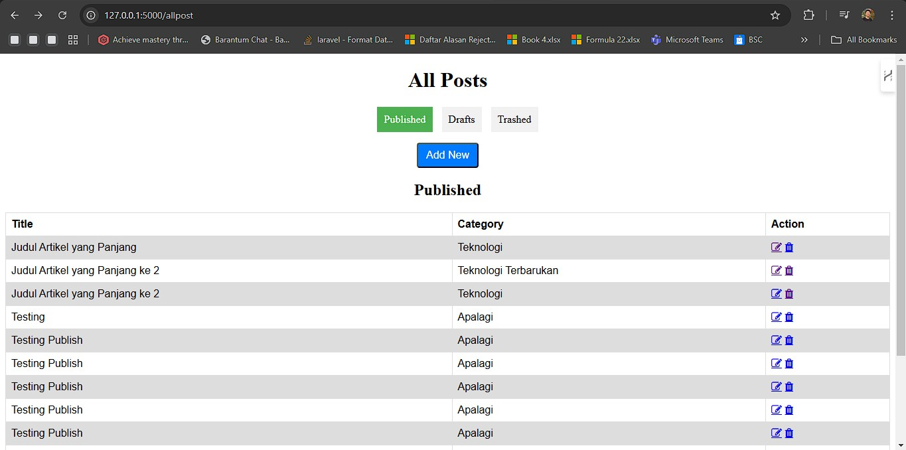
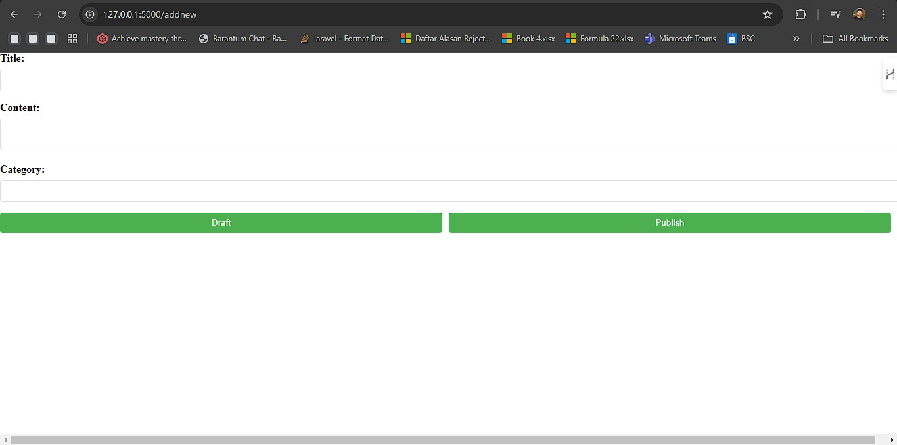
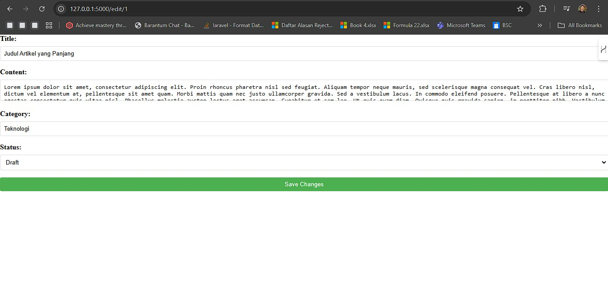
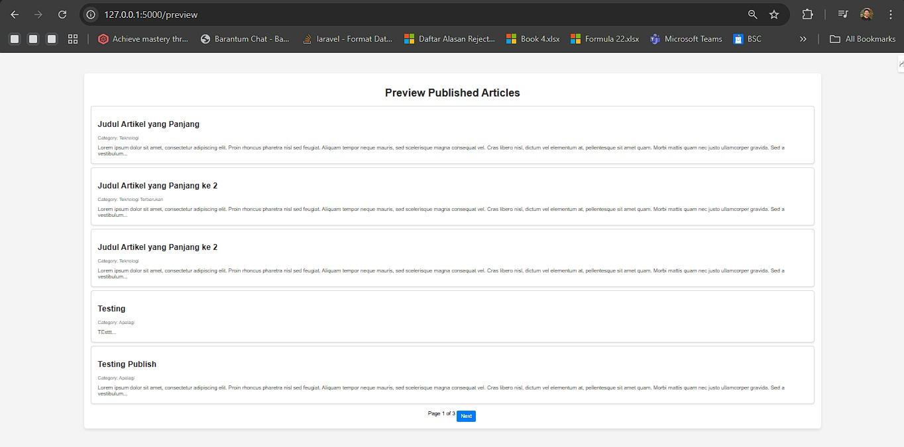

# Project Name

Deskripsi proyek singkat.

## Cara Menggunakan

### 1. **Clone Proyek**
   Pertama, clone repositori ini ke komputer kamu:
   
   git https://github.com/Rizanoer/article-py-fe-be.git

### 2. **Install Depedensi**
  Jalankan `pip install -r requirements.txt`
  
### 3. **Migrasi Database**
  Jalankan `python database.py`

  Maka akan terbentuk database dengan nama *article*

### 4. **Import database untuk table posts**
  nama file `article_post.sql`
  import melalui Phpmyadmin

### 5. **Jalankan server virtual**
  jalankan `.venv\Scripts\activate`
  lalu jalankan `flask run`

  setalah itu akan keluar host `Running on http://127.0.0.1:5000`
  web bisa di akses

### 6. (Optional) CRUD dengan Postman
  collation terdapat di folder `postman`
  import collation yang sudah tersedia

### 7. Tampilan Dashboard
  All Post
  

  Add Post
  

  Edit Post
  

  Preview Blog
  

